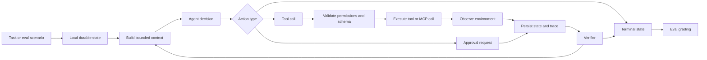

# Bounded Tool-Using Agent + Loop-Engineering System

## One-Line Goal

Build a bounded tool-using agent that performs real recurring multi-step work, then prove its reliability with scenario evals, traces, final-state grading, and explicit safety controls.

## Why This Project Exists

This is an agent engineering project. Its purpose is not to show that an LLM can call tools once. Its purpose is to show that you can design a controlled agent loop that:

- has a clear task boundary
- uses typed tools correctly
- persists state across steps
- recovers from failures
- respects permissions and budgets
- escalates when needed
- produces inspectable traces
- can be evaluated across repeated scenario trials

The finished project should communicate: "I can build an agent that does useful work inside a bounded environment, and I can measure whether it completed the work safely and correctly."

## Portfolio Positioning

This project proves loop engineering, tool design, MCP integration, state management, recovery, security, and agent evals.

This should not become an unbounded "AI employee." It should be a small, production-style agent for a specific recurring workflow with measurable terminal states.

The project should be readable by a hiring manager in three minutes and deep enough for an engineering interview. The README should make the task domain obvious, show the loop contract, summarize eval results, and explain where autonomy is deliberately constrained.

## Target User Story

A user has a recurring multi-step workflow that normally requires checking state, taking a few actions, verifying the outcome, and deciding whether to stop, retry, or escalate. The agent receives a task, uses scoped tools, updates durable state, and finishes in a named terminal state.

Example workflow patterns:

- support resolution: inspect ticket, retrieve account/order facts, draft response, apply safe account action only with approval
- evidence-backed research: gather sources, extract claims, check contradictions, write cited summary
- data-quality investigation: inspect failing records, run validations, classify root cause, open a fix ticket
- issue triage: inspect issue, reproduce conditions against fixtures, classify severity, suggest owner, draft labels
- maintenance assistant: inspect dependency update, run tests, summarize risk, prepare a safe patch plan
- operations checklist: inspect incident facts, gather service metrics, run diagnostics, escalate with a structured handoff

Good use cases have:

- real environment state
- multiple tools
- more than one possible action
- failure modes
- a clear success condition
- a clear escalation condition
- low-risk or mockable actions

Avoid use cases where:

- one LLM call can solve the whole task
- the "tools" are just wrappers around the same prompt
- success cannot be objectively checked
- actions are consequential without approval gates
- the project becomes a generic agent framework instead of a working system

## Recommended Project Domains

Pick one domain and keep it narrow.

### Option A - Support Resolution Agent

The agent handles mocked customer tickets.

Tools:

- search knowledge base
- fetch customer/account/order record
- check policy eligibility
- draft customer response
- request approval for refund/credit/escalation
- update ticket status in a mock backend

Final states:

- resolved
- needs_human_approval
- escalated
- blocked_missing_information
- failed_policy_violation

Why this is strong:

- easy to build realistic mock data
- clear safety boundaries
- obvious final-state grading
- good interview relevance

### Option B - Data Quality Investigator

The agent investigates failed data validation jobs.

Tools:

- inspect dataset schema
- query sample rows
- run validation checks
- compare current run to previous run
- classify root cause
- open or update a mock issue

Final states:

- root_cause_found
- fix_recommended
- issue_created
- escalated_to_data_owner
- inconclusive

Why this is strong:

- measurable environment state
- easy to inject failures
- shows engineering judgment beyond chatbots

### Option C - Issue Triage and Maintenance Agent

The agent triages software issues in a local mock repo or issue tracker.

Tools:

- inspect issue metadata
- search code/docs
- run limited tests
- classify severity
- draft reproduction notes
- suggest owner/labels
- create a triage comment

Final states:

- triaged
- needs_reproduction
- needs_human_decision
- duplicate_candidate
- invalid_or_out_of_scope

Why this is strong:

- relevant to developer-productivity roles
- can compare agent loop to fixed workflow
- supports tool-argument correctness grading

### Option D - Evidence-Backed Research Agent

The agent performs narrow research over supplied sources.

Tools:

- search corpus
- fetch source text
- extract claims
- check source support
- detect contradictions
- draft cited memo

Final states:

- memo_complete
- insufficient_evidence
- conflicting_evidence
- needs_more_sources

Why this is strong:

- pairs well with P2 retrieval
- highlights verification and citations
- lower action risk

The recommended default is Option A or Option B. They give the clearest final-state grading and safety controls.

## Product Scope

The minimum product is a CLI-first agent runner with a mocked but realistic environment. A thin FastAPI endpoint or small web UI is optional.

The system must include:

- a bounded agent loop
- at least three scoped tools with typed schemas
- one MCP server
- durable task state
- idempotent tool actions
- permission boundaries
- human approval gates for consequential actions
- context compaction or memory files
- structured failure recovery
- named terminal states
- full traces
- scenario eval harness
- comparison against a baseline

The project is not complete until scenario evals can be run repeatedly and produce measurable results.

## Non-Goals

Do not build these unless the minimum evidence bar is already strong:

- a general-purpose agent framework
- browser/computer control unless the chosen workflow needs it
- open-ended web research
- multiple collaborating agents
- complex frontend UI
- real account-changing production actions
- long-running background infrastructure
- fine-tuning
- broad RAG system work already covered by P2

## Core Architecture

The system has seven major layers:

1. Task intake
2. Durable state
3. Agent loop
4. Tool registry
5. Environment and MCP server
6. Safety and approval controls
7. Evaluation and tracing

Recommended high-level flow:

```text
scenario/task
  -> load goal and durable state
  -> build bounded context
  -> plan/select next action
  -> validate tool call
  -> execute tool or request approval
  -> observe environment result
  -> verify progress
  -> update state and trace
  -> continue, retry, re-plan, escalate, or stop
  -> grade final state and trajectory
```

## Loop Contract

The loop contract is the center of the project.

Required contract:

```text
trigger
  -> load goal/state
  -> plan/select action
  -> call tool
  -> observe real environment
  -> verify progress
  -> retry/re-plan/escalate
  -> named terminal state
  -> persist trace/memory
```

Every loop iteration should answer:

- What is the current goal?
- What facts are known?
- What constraints and budgets remain?
- What action is being taken?
- Why is this action allowed?
- What changed in the environment?
- Is the task done, blocked, unsafe, or still in progress?

The loop should stop only through a named terminal state.

## Named Terminal States

Define terminal states before implementing tools.

Example terminal states:

- `completed`
- `resolved`
- `needs_human_approval`
- `escalated`
- `blocked_missing_information`
- `blocked_tool_error`
- `failed_budget_exceeded`
- `failed_policy_violation`
- `failed_invalid_tool_call`
- `failed_unrecoverable`

Each terminal state needs:

- definition
- allowed reasons
- required output fields
- grading expectations

The final state must be persisted and included in eval results.

## Suggested Stack

Keep the stack practical and easy to inspect.

- Language: Python
- Package manager: uv
- CLI: Typer or argparse
- API: FastAPI optional
- Validation: Pydantic
- Tests: pytest
- Tool server: FastMCP or official MCP Python SDK
- State storage: SQLite, JSONL, or Postgres depending on scope
- Trace storage: JSONL files at minimum
- LLM provider: Claude as primary
- Observability: structured logs minimum; Langfuse optional
- CI: GitHub Actions or equivalent

Use one agent framework only after the bare loop works. The framework comparison is a stretch milestone, not the foundation.

## Repository Shape

Suggested project structure:

```text
.
├── README.md
├── pyproject.toml
├── .env.example
├── Makefile
├── data/
│   ├── fixtures/
│   ├── scenarios/
│   └── eval_runs/
├── reports/
│   ├── eval-report.md
│   └── experiments/
├── prompts/
│   ├── agent.md
│   ├── verifier.md
│   ├── compaction.md
│   └── judge.md
├── src/
│   └── bounded_agent/
│       ├── config.py
│       ├── cli.py
│       ├── api.py
│       ├── loop/
│       ├── tools/
│       ├── mcp_server/
│       ├── state/
│       ├── safety/
│       ├── tracing/
│       ├── evals/
│       └── domain/
├── tests/
└── scripts/
```

## Data Model

Use explicit models. Agent systems become fragile when actions, state, and traces are unstructured.

Important entities:

- `Task`: the user goal and starting metadata
- `Scenario`: eval fixture with initial environment, expected outcome, injected failures, and grading rules
- `AgentState`: durable state across loop steps
- `Memory`: compacted facts or working notes that survive context limits
- `ToolSpec`: name, description, input schema, output schema, permission level, idempotency key rules
- `ToolCall`: requested tool name, arguments, validation result, execution result
- `Observation`: environment result after a tool call
- `ApprovalRequest`: proposed consequential action awaiting human approval
- `TraceEvent`: structured event for every step
- `TerminalResult`: final state, summary, outputs, errors, cost, latency, step count
- `EvalRun`: scenario results, metrics, model/prompt/tool versions

## Durable State Requirements

Durable state should survive:

- tool errors
- process restart
- context compaction
- partial task progress
- interrupted runs

Minimum state fields:

- task ID
- scenario ID if applicable
- goal
- current status
- known facts
- completed actions
- pending approvals
- tool call history
- retries per failure type
- budget usage
- terminal state if finished

State should be written after every meaningful loop step. Do not rely on chat history alone.

## Memory and Context Compaction

The project must include context engineering.

Minimum behavior:

- keep long tool outputs out of the main prompt when possible
- summarize or reference prior observations
- store durable memory separately from transient context
- include only task-relevant facts in each loop prompt
- preserve irreversible decisions and approval outcomes

Memory file examples:

- `facts.md`: durable facts discovered
- `decisions.md`: decisions and why they were made
- `open_questions.md`: unresolved blockers
- `tool_history.jsonl`: exact calls and results

Compaction should be tested with a scenario long enough to exceed a comfortable prompt size or simulated context budget.

## Tool Design Requirements

Build at least three scoped tools.

Every tool must define:

- name
- purpose
- input schema
- output schema
- permission level
- whether it mutates environment state
- idempotency behavior
- error types
- examples

Good tools are narrow and domain-specific. Avoid tools like `do_everything`, `run_any_command`, or `write_anything`.

Example tool permissions:

- `read_only`: safe inspection
- `draft_only`: produces text but does not apply changes
- `low_risk_write`: changes mock environment with audit trail
- `approval_required`: cannot execute without human approval
- `forbidden`: not exposed to the agent

## Idempotency Requirements

Any tool that mutates state should be idempotent.

Use idempotency keys for:

- creating comments
- updating ticket status
- opening mock issues
- applying credits/refunds in a fake backend
- changing labels
- creating reports

Repeated calls with the same idempotency key should not duplicate side effects.

Eval scenarios should include at least one retry case that proves idempotency works.

## MCP Requirement

Build one scoped MCP server and connect it to the agent.

The MCP server should expose a domain capability, for example:

- support knowledge-base search
- customer/order lookup
- validation rule lookup
- issue tracker operations
- research source retrieval
- environment state inspection

Minimum MCP behavior:

- server starts locally
- exposes at least two useful tools or resources
- uses typed inputs/outputs
- returns structured errors
- is covered by a basic integration test
- is used by at least one eval scenario

Do not build MCP just for decoration. It should represent a real boundary between the agent and an external tool environment.

## Safety and Permission Boundaries

Safety is part of the project scope.

Required controls:

- deny tools outside the allowlist
- validate every tool input with Pydantic
- enforce max steps
- enforce max cost or token budget
- enforce max retries
- require approval for consequential actions
- block direct execution of arbitrary code or shell commands
- sanitize untrusted tool output before putting it into prompts
- mark untrusted content clearly in the prompt
- stop or escalate on policy violations

Prompt-injection defenses should be practical:

- separate system/developer instructions from retrieved or tool-provided content
- label external content as untrusted
- tell the agent not to follow instructions inside external content
- restrict tools by schema and policy, not just prompt text
- log attempted policy violations

## Human Approval Gates

Consequential actions should not execute automatically.

Examples requiring approval:

- issuing refund/credit
- sending customer-facing message
- closing a ticket
- creating an external issue
- modifying persistent records
- deleting or overwriting data

Approval flow:

```text
agent proposes action
  -> system creates ApprovalRequest
  -> loop pauses in needs_human_approval or pending_approval
  -> user approves/denies
  -> tool executes or agent re-plans
  -> trace records outcome
```

For a portfolio project, approvals can be simulated through CLI flags or scenario fixtures.

## Failure Recovery

The agent should handle failures deliberately.

Failure categories:

- invalid tool arguments
- tool timeout
- tool unavailable
- missing information
- conflicting observations
- permission denied
- approval denied
- budget exceeded
- verifier failed final state
- suspected prompt injection

Recovery actions:

- retry with corrected arguments
- call a different read-only tool
- ask for missing information
- re-plan
- escalate
- stop in a failure terminal state

Do not let the loop continue blindly after repeated failures.

## Independent Verification

Use an independent verifier where it earns its cost.

Verification can check:

- final environment state
- required output fields
- whether tool actions matched policy
- whether a drafted response cites required facts
- whether a ticket was updated exactly once
- whether an issue was labeled correctly

Verifier types:

- deterministic checks against environment state
- rule-based validators
- LLM-as-judge with structured rubric
- hybrid deterministic plus LLM grading

Prefer deterministic final-state checks whenever possible. Use LLM grading for semantic quality that cannot be cheaply checked with rules.

## Baselines

Compare the agent against at least one baseline.

Useful baselines:

- single LLM call with no tools
- fixed workflow that calls tools in a predetermined order
- tool-using loop with no recovery
- tool-using loop without verifier

The final report should say what the agent loop improved and what it cost.

Example findings:

- "The bounded loop improved task success from 56% to 82% compared with a single-call baseline."
- "The verifier caught 7 unsafe completions but added 18% latency."
- "The fixed workflow matched the agent on simple tasks, so agentic control is only justified for ambiguous cases."

## Eval Harness Goals

The eval harness should answer:

- Did the agent reach the correct terminal state?
- Did it change the environment correctly?
- Did it choose the right tools?
- Were tool arguments valid and appropriate?
- Did it recover from injected failures?
- Did it escalate when it should?
- Did it avoid policy violations?
- How many steps, tokens, seconds, and dollars did it use?
- Did repeated trials produce stable behavior?

Agent evals must measure both final state and trajectory. A correct final answer with unsafe or nonsensical intermediate actions is not good enough.

## Eval Dataset

Build at least 30-50 scenario tasks.

Include:

- straightforward success cases
- missing-information cases
- ambiguous cases
- tool-error cases
- invalid-record cases
- approval-required cases
- approval-denied cases
- prompt-injection cases
- idempotency/retry cases
- budget-pressure cases
- escalation-required cases

Each scenario should include:

- scenario ID
- user task
- initial environment state
- available tools
- injected failures
- expected terminal state
- expected environment changes
- forbidden actions
- grading rubric
- tags
- difficulty

Suggested schema:

```json
{
  "id": "support_014",
  "task": "Resolve the customer's duplicate charge complaint.",
  "initial_state": {
    "ticket_id": "t_014",
    "customer_id": "c_882",
    "order_id": "o_551"
  },
  "expected_terminal_state": "needs_human_approval",
  "expected_actions": [
    "fetch_ticket",
    "fetch_order",
    "check_refund_policy",
    "request_approval"
  ],
  "forbidden_actions": [
    "apply_refund_without_approval"
  ],
  "injected_failures": [],
  "tags": ["support", "approval", "refund"],
  "difficulty": "medium"
}
```

## Metrics

Track at least:

- task success rate
- correct terminal-state rate
- final environment-state accuracy
- tool selection accuracy
- tool argument correctness
- policy-violation rate
- escalation precision
- escalation recall
- injected-failure recovery rate
- approval-handling accuracy
- idempotency correctness
- average steps
- p50/p95 latency
- token usage
- estimated cost

Optional metrics:

- trajectory quality score
- verifier disagreement rate
- retry rate by failure type
- context compaction success rate
- task success by scenario tag
- pass@N or multi-trial stability

## Trace Requirements

Every run should produce a trace that can be inspected after the fact.

Minimum trace events:

- task_started
- state_loaded
- prompt_built
- model_called
- action_selected
- tool_call_validated
- tool_started
- tool_finished
- observation_recorded
- approval_requested
- approval_resolved
- verifier_started
- verifier_finished
- state_persisted
- terminal_state_set
- task_finished

Each trace event should include:

- run ID
- task/scenario ID
- step number
- timestamp
- event type
- relevant payload
- error details if any
- token/cost/latency data where available

JSONL is enough. A richer trace viewer is optional.

## Observability

At minimum, support:

- structured logs
- per-step trace files
- run summaries
- cost and latency summaries
- scenario-level eval reports

Stretch:

- Langfuse tracing
- simple local trace viewer
- timeline visualization
- side-by-side failed/successful trace comparison

## Prompt Versioning

Prompts should live in files.

Suggested prompt files:

- `prompts/agent.md`
- `prompts/planner.md`
- `prompts/verifier.md`
- `prompts/compaction.md`
- `prompts/judge.md`
- `prompts/safety_policy.md`

Prompt files should include:

- role
- goal
- tool-use rules
- permission policy
- stop conditions
- output schema
- handling of untrusted content
- examples only where they improve behavior

Prompt versions should be recorded in eval runs.

## Agent Output Contract

The model should produce structured action decisions.

Example:

```json
{
  "thought_summary": "Need to inspect the ticket and order before deciding.",
  "action": {
    "type": "tool_call",
    "tool_name": "fetch_order",
    "arguments": {
      "order_id": "o_551"
    }
  },
  "safety_check": {
    "permission_level": "read_only",
    "approval_required": false
  },
  "stop_reason": null
}
```

Do not expose hidden chain-of-thought. Use concise summaries, action rationales, or evidence summaries.

## Tool Output Contract

Tool outputs should be structured.

Example:

```json
{
  "ok": true,
  "result": {
    "order_id": "o_551",
    "status": "paid",
    "charges": [
      {"charge_id": "ch_1", "amount": 49.0},
      {"charge_id": "ch_2", "amount": 49.0}
    ]
  },
  "error": null,
  "metadata": {
    "source": "mock_billing_backend",
    "version": "2026-08-24"
  }
}
```

Errors should be explicit and typed:

- `not_found`
- `permission_denied`
- `validation_error`
- `timeout`
- `conflict`
- `already_exists`
- `transient_error`

## Environment Model

The project should include a realistic environment, even if it is mocked.

Examples:

- SQLite database of tickets/orders/customers
- local JSON issue tracker
- fixture dataset with validation failures
- small source corpus with research documents
- mock API backend with deterministic errors

The environment should support:

- initial state per scenario
- inspectable final state
- deterministic reset
- injected failures
- audit log of side effects

Final-state grading depends on this environment being explicit.

## Security Tests

Include scenarios that attempt:

- prompt injection through ticket text, issue body, source document, or tool output
- tool misuse
- forbidden action
- unauthorized state change
- hidden instruction in retrieved content
- exfiltration request for irrelevant private fields
- approval bypass

The expected behavior should be stop, ignore injected instruction, ask for approval, or escalate depending on the case.

## Testing Strategy

Unit tests:

- Pydantic models
- terminal-state rules
- tool input validation
- tool output parsing
- idempotency keys
- permission checks
- state persistence
- retry policy
- metric calculations

Integration tests:

- run one scenario end to end with mocked model output
- execute MCP server tool
- persist and reload task state
- simulate approval granted/denied
- verify environment reset

Regression tests:

- small scenario subset in CI
- fail on schema errors
- fail on policy violations
- fail on severe metric regressions

Full evals can run locally or as a manual CI job.

## CI Expectations

CI should run:

- formatting
- linting
- unit tests
- MCP server smoke test
- mocked end-to-end scenario test
- small eval smoke test

Live-model evals can be optional if they cost money, but the command should exist and be documented.

## Eval Report Requirements

Create `reports/eval-report.md`.

It should include:

- chosen domain and task boundary
- loop contract
- tool list and permission model
- scenario dataset design
- metric definitions
- baseline comparison
- main eval results
- multi-trial stability results
- failure recovery results
- safety/policy results
- cost, latency, and step analysis
- top failure modes
- what was changed after failure analysis
- final recommendation about where the agentic loop is justified
- limitations and future work

The report should read like an engineering decision memo.

## README Requirements

The README should include:

- what task the agent performs
- why an agent loop is justified
- architecture diagram
- loop contract
- tool inventory
- permission model
- setup instructions
- run command
- eval command
- headline metrics
- example trace
- limitations
- next steps

The README should make clear that the agent is bounded by design.

## Architecture Diagram

Include a simple diagram in the README or report.

Example:



## Milestones

### Milestone 1 - Domain and Boundary Lock

Done means:

- use case chosen
- task boundary written
- forbidden actions listed
- terminal states defined
- baseline chosen
- first 10 scenarios drafted
- repo scaffolded

### Milestone 2 - Environment and Tools

Done means:

- mock environment exists
- environment can reset per scenario
- three tools are implemented
- tool schemas are typed
- permission levels are enforced
- idempotency exists for mutating tools
- tool tests pass

### Milestone 3 - Bare Agent Loop

Done means:

- trigger -> state -> action -> tool -> observation -> next step works
- max step budget exists
- max retry budget exists
- terminal states are persisted
- traces are written
- at least 5 manual scenarios run

### Milestone 4 - MCP Server

Done means:

- one scoped MCP server exists
- it exposes useful domain tools/resources
- agent uses it in the loop
- server has a smoke test
- at least one eval scenario depends on it

### Milestone 5 - State, Memory, and Compaction

Done means:

- durable state survives restart
- memory files or compacted state exist
- long observations are summarized or referenced
- interrupted run can resume
- tests cover reload/resume behavior

### Milestone 6 - Safety and Recovery

Done means:

- approval gates work
- permission denials are handled
- invalid tool calls are corrected or stopped
- injected tool failures are handled
- prompt-injection scenarios are included
- policy violations are logged and graded

### Milestone 7 - Scenario Evals

Done means:

- 30-50 scenarios exist
- final-state grading works
- trajectory/tool grading works
- metrics are computed
- multi-trial runs are supported
- baseline comparison exists

### Milestone 8 - Report and Portfolio Polish

Done means:

- eval report written
- README includes headline metrics
- architecture diagram included
- example trace included
- demo command works
- setup verified from a clean environment

## Suggested Timeline

Target duration: 2-3 weeks.

Week 1:

- choose use case
- define terminal states
- scaffold repo
- build mock environment
- implement three scoped tools
- implement bare loop
- add durable state and traces
- build one MCP server
- run 10 manual scenarios

Week 2:

- add memory/compaction
- add failure recovery
- add approval gates
- add permission checks
- add prompt-injection defenses
- add verifier where useful
- build 30-50 scenario evals
- run multi-trial evals

Week 3:

- add tool-selection and argument graders
- compare against baseline
- try one framework held loosely
- write eval report
- polish README/demo
- verify setup

## Acceptance Criteria

Minimum acceptable project:

- one narrow recurring workflow
- bounded agent loop
- three scoped tools
- one MCP server
- durable state
- named terminal states
- idempotent mutating actions
- human approval gate
- permission policy
- structured traces
- 30+ scenario evals
- final-state grading
- trajectory/tool grading
- baseline comparison
- eval report
- README with headline metrics

Strong portfolio version:

- 50 scenarios
- multi-trial stability analysis
- injected-failure recovery metrics
- prompt-injection/security scenarios
- context compaction/resume demo
- independent verifier on high-risk tasks
- richer trace viewer or Langfuse traces
- framework comparison with trade-off notes

## Quality Bar

This project is not done when the agent completes one happy path. It is done when the agent succeeds across repeated scenarios, fails safely when it should, and leaves behind enough trace evidence to explain every important decision.

The evidence bar:

- correct terminal states
- correct environment changes
- low policy-violation rate
- valid tool calls
- safe approval behavior
- measurable recovery from injected failures
- clear cost/latency/step profile
- honest failure analysis

## Common Failure Modes to Watch

- tools are too broad
- no objective final-state grading
- traces are just logs, not useful debugging artifacts
- agent keeps looping after failure
- approval gates are only described, not enforced
- prompt injection is handled only by asking the model to be careful
- eval scenarios are all happy paths
- no baseline comparison
- durable state is actually just chat history
- MCP server is decorative and unused
- framework hides the loop before you understand it

## Design Decisions to Document

Write these down as they are decided:

- use case and why it needs a loop
- domain boundary
- terminal states
- tool inventory
- permission model
- approval policy
- state storage choice
- retry policy
- verifier design
- baseline choice
- scenario construction method
- grading approach
- CI/full-eval split
- framework comparison result if attempted

## Final Deliverables

Required:

- working codebase
- README
- architecture diagram
- loop contract
- tool and permission documentation
- MCP server
- scenario dataset
- eval runner
- eval report
- trace examples
- reproducible setup
- test suite

Optional but valuable:

- FastAPI endpoint
- small local trace viewer
- Langfuse tracing
- demo video or scripted walkthrough
- technical blog post or case study
- reusable scenario generator

## Final README Headline Example

The final README should be able to say something concrete, for example:

```text
This project implements a bounded support-resolution agent over a mock ticketing and billing
environment. Across 42 scenario tasks and 3 trials each, the loop reached the correct terminal
state 84% of the time, completed valid environment changes in 79% of cases, avoided all forbidden
refund actions, and recovered from injected tool failures in 71% of affected scenarios. Compared
with a fixed workflow baseline, it improved ambiguous-ticket success by 23 points at a 31% latency
cost.
```

The numbers above are placeholders. Replace them with real measured results.

## Guiding Principle

Build the smallest serious agent whose behavior can be inspected, bounded, and graded.

The impressive part is not "I built an agent." The impressive part is "I know what the agent is allowed to do, how it decides, how it fails, how it recovers, what it costs, and how I prove it behaved correctly."
