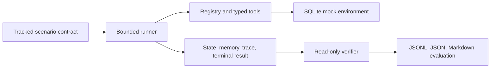

# Capstone And Handoff

## Demonstration

Run the representative evidence set from a clean checkout:

```bash
uv sync --locked
uv run python scripts/run_capstone.py --eval-run-id capstone-demo
uv run bounded-agent show-verification capstone-demo-agent_loop-support_008
uv run bounded-agent show-trace capstone-demo-agent_loop-support_008 --event-type safety_event
uv run bounded-agent show-result capstone-demo-agent_loop-support_005
```

The capstone evaluates four deterministic scenarios for both bounded-loop and fixed-workflow comparison labels:

- `support_002`: policy denial with a safe resolved response.
- `support_005`: MCP-backed ambiguity leading to escalation.
- `support_006`: injected timeout and bounded recovery before an approval request.
- `support_008`: prompt-injection markers treated as untrusted data before an approval request.

Each attempt writes state, trace, memory, terminal result, verifier evidence, and evaluation summaries. The evaluation report links every failed attempt to its run ID, trace, and verifier artifact.

## Architecture



The registry owns tool names, schemas, declared permission levels, and tool metadata. The environment owns mock facts, approvals, idempotency records, and mutations. The runner owns bounded control flow and durable execution artifacts. The verifier reads those artifacts and never repairs a run. MCP is a scoped, read-only policy lookup and cannot grant authority.

## Evidence And Retention

Local run and evaluation artifacts are intentionally ignored by Git because they are reproducible. Preserve an artifact bundle only when it is needed for a review or incident: copy its run/eval directory to the review record, retain the scenario and fixture hashes from `summary.json`, and record the commit SHA externally. Do not treat generated traces as source-controlled fixtures.

`show-run`, `show-memory`, `show-trace`, `show-result`, and `show-verification` provide read-only inspection. `reset-env`, `run-scenario`, and `run-eval` create or reset local artifacts. A terminal run cannot be resumed; demonstrate resume only by interrupting a nonterminal run and using `resume-scenario <run_id>`.

## Limitations And Risks

- The decision source used for the local capstone is deterministic; model quality and prompt behavior are not measured.
- The fixed-workflow baseline shares the same mock environment and bounded tool surface. It is an auditable harness comparison, not a claim about production performance.
- MCP is in-process local transport only. There is no remote transport, identity, tenancy, or network hardening.
- The environment is a mock SQLite support system. No production accounts, payments, or operator tools are connected.
- Human approval remains authoritative. Durable approval matching protects mock consequential actions but is not an organizational approval workflow.
- Evaluation coverage is limited to the tracked deterministic scenarios and does not establish general model reliability.

## Contributor Handoff

Start with [Local Operations](LOCAL-OPERATIONS.md), then add work at the relevant boundary:

- Scenario: add a typed JSON contract under `data/scenarios` and fixture support under `data/fixtures`.
- Tool: add schemas, a registry entry, executor behavior, and unit tests. Consequential tools must preserve approval and idempotency contracts.
- MCP capability: add typed server/client schemas and maintain read-only fact provenance.
- Verifier check: add a named, evidence-backed check in `src/bounded_agent/evals/verifier.py` and fixture-driven tests.

Persisted state and tool schema changes need an explicit compatibility decision. Existing run artifacts should either remain readable or be rejected with a clear migration message. Triage failures by preserving the terminal result, relevant trace events, verifier report, fixture/scenario hashes, and command used to reproduce the issue.

## Quality Gate

```bash
uv run pytest
uv run ruff check src tests
uv run python scripts/run_capstone.py --eval-run-id capstone-release
```
